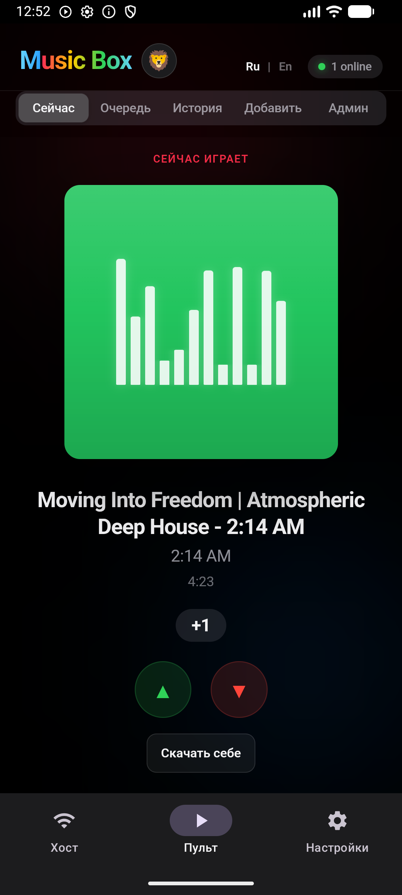
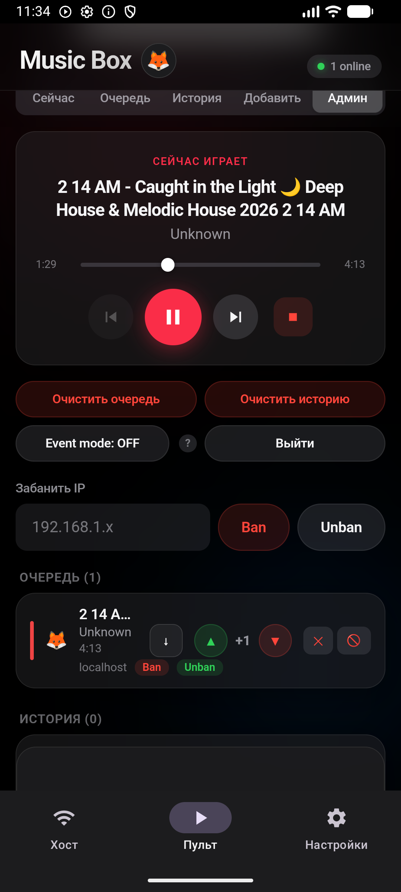
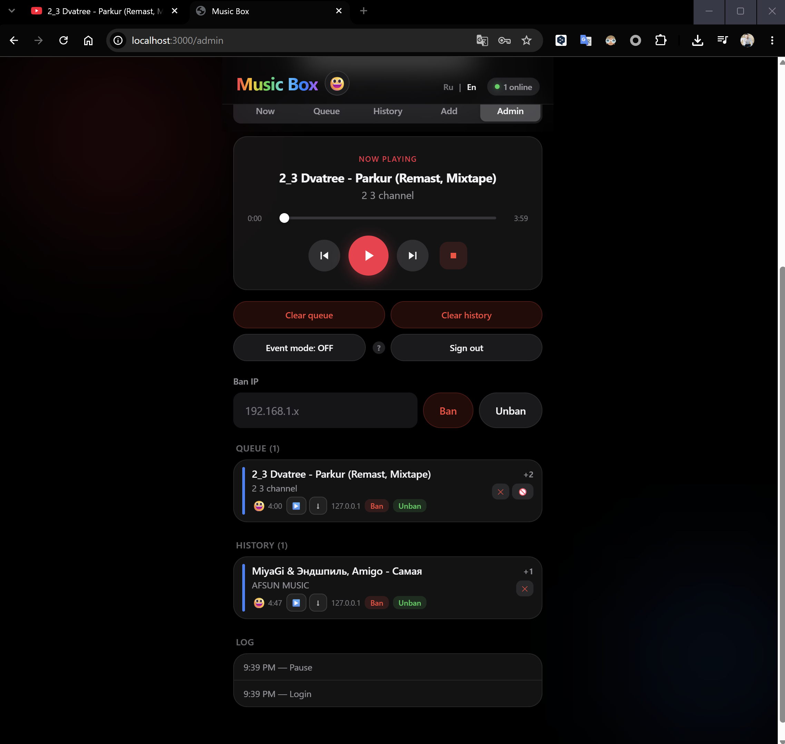

# Music Box

Локальный музыкальный плеер-голосовалка для тусовок. Сервер крутится на Windows, гости подключаются с телефонов по WiFi, добавляют треки и голосуют — очередь перестраивается в реальном времени. Музыка играет на колонках компьютера-хоста.

## Скриншоты

<p align="center">
  
  &nbsp;
  
</p>

<p align="center">
  
</p>

## Скачать

Готовые сборки: [последний релиз](https://github.com/MetanoicArmor/music-box/releases/latest)

| Платформа | Файл |
|-----------|------|
| Windows (portable) | [MusicBox-win64.zip](https://github.com/MetanoicArmor/music-box/releases/latest/download/MusicBox-win64.zip) |
| Android (хост) | [MusicBox-android.apk](https://github.com/MetanoicArmor/music-box/releases/latest/download/MusicBox-android.apk) |

## Быстрый старт

### Portable (для хоста, без установки Node.js)

Архив нужен только на ПК с колонками — гости подключаются с телефонов по Wi‑Fi.

1. Скачайте [MusicBox-win64.zip](https://github.com/MetanoicArmor/music-box/releases/latest/download/MusicBox-win64.zip)
2. Распакуйте и запустите **`MusicBox.bat`**
3. Смените пароль в `config.json` (`adminPassword`)
4. Гостям — QR-код из админки (или ссылку из консоли)

Собрать архив самому: `npm run release` (нужен Node.js).

### Из исходников (для разработки)

1. Установите [Node.js 20+](https://nodejs.org/)
2. Дважды кликните `start.bat` (или `MusicBox.bat`)
3. Смените пароль в `config.json` (`adminPassword`)
4. Гостям — QR из админки или Network-ссылка из консоли

## Возможности

- **Голосование** — ▲/▼ на каждом треке, автo-upvote при добавлении
- **Очередь** — сортировка по голосам, кик при -2 (настраивается)
- **Локальные файлы** — загрузка mp3/mp4 с телефона, работает **без интернета**
- **YouTube / Spotify** — по ссылке или поиску (нужен интернет)
- **Админ-панель** — удалить трек, удалить артиста целиком, бан IP, skip/pause, event mode
- **QR-код** — для быстрого подключения на open-air

## Конфигурация

Скопируйте `config.example.json` → `config.json`:

```json
{
  "port": 3000,
  "adminPassword": "changeme",
  "kickThreshold": -2,
  "voteRateLimit": 10,
  "voteRateWindowSec": 30,
  "maxUploadMb": 100,
  "eventMode": false
}
```

## Разработка

```bash
npm install
npm run dev          # сервер :3000 + клиент :5173
npm run build        # production build
npm start            # запуск production
npm run setup        # скачать mpv + yt-dlp
npm run release      # portable ZIP для Windows (release/MusicBox-win64.zip)
```

## Open-air тусовка

1. Поднимите WiFi (роутер или hotspot с телефона)
2. Подключите ноутбук и колонки (AUX / Bluetooth)
3. Запустите `start.bat`
4. Раздайте гостям QR-код из админки (`/admin`)
5. Без интернета работают только загруженные mp3/mp4

### Firewall (если телефоны не видят сервер)

```powershell
netsh advfirewall firewall add rule name="Music Box" dir=in action=allow protocol=TCP localport=3000
```

## Android-хост

Телефон/планшет может быть хостом вместо Windows-ПК: гости по-прежнему открывают тот же веб-UI по Wi‑Fi.

Скачать APK: [MusicBox-android.apk](https://github.com/MetanoicArmor/music-box/releases/latest/download/MusicBox-android.apk) (sideload).

Собрать самому:

```bash
npm run build:android
```

APK: `android/app/build/outputs/apk/release/app-release.apk`. Нужны JDK 17 и Android SDK (`ANDROID_HOME`).

В приложении: **Старт** → раздайте QR. Музыка играет на динамике/Bluetooth хоста. Без интернета работают только загруженные файлы.

Локальная библиотека на телефоне: **Music/MusicBox** (в проводнике Windows по USB: внутренняя память → `Music` → `MusicBox`). После копирования файлов запустите хост или откройте вкладку «Добавить».

## Зависимости

- **Node.js 20+** — сервер и UI
- **mpv** — воспроизведение на Windows (скачивается через `npm run setup`)
- **yt-dlp** — YouTube/Spotify резолв (скачивается через `npm run setup`)

Если mpv не скачался автоматически: `winget install shinchiro.mpv` (или просто запустите `start.bat` — установит сам)

## Структура

```
music-box/
├── start.bat           # запуск одной кнопкой
├── stop.bat            # остановка сервера и mpv
├── config.json         # настройки
├── server/             # Fastify API + WebSocket + mpv
├── client/             # React UI
├── android/            # Kotlin-хост (Ktor + ExoPlayer)
├── media/              # загруженные файлы
├── data/               # SQLite база
└── bin/                # mpv.exe, yt-dlp.exe
```

## Лицензия

© 2026 Vade (MetanoicArmor). All rights reserved.
