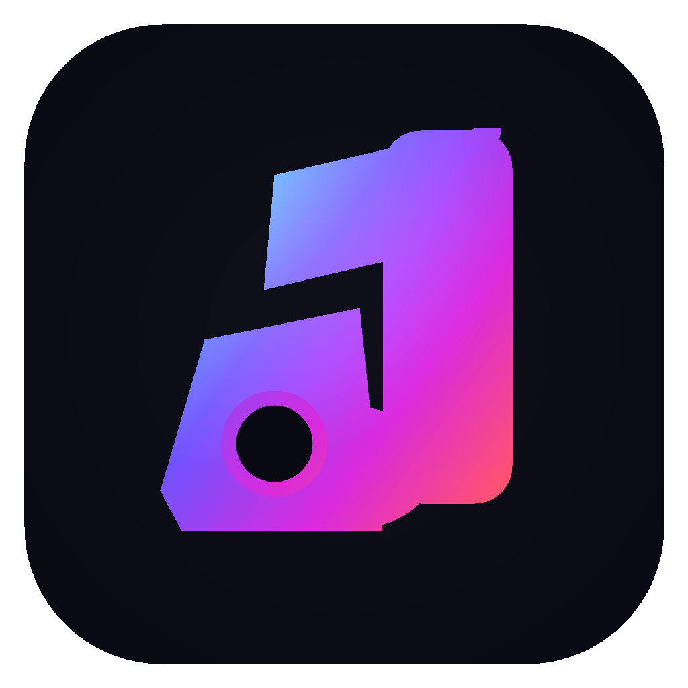
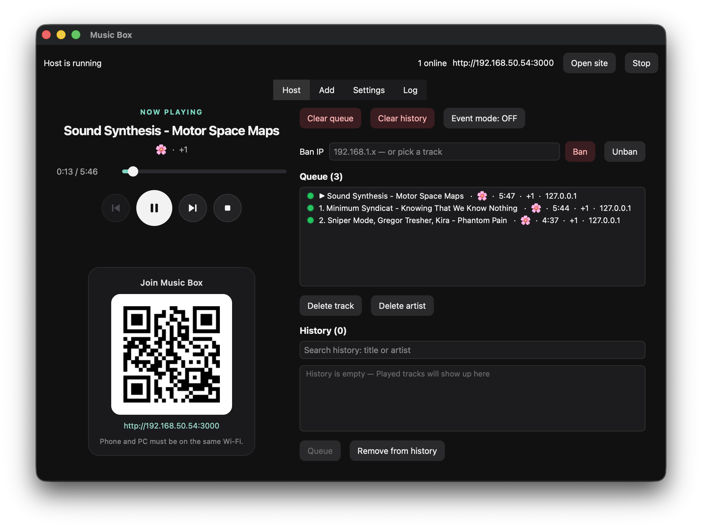
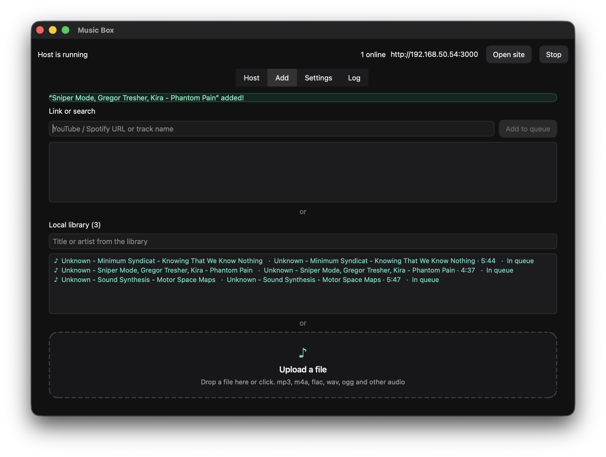
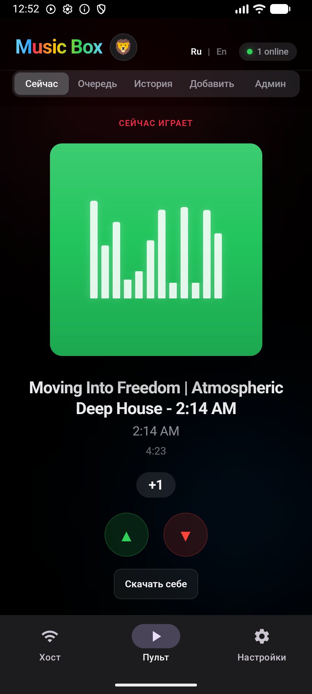

<p align="center">
  
</p>

# Music Box

Локальный музыкальный плеер-голосовалка для тусовок. На компьютере с колонками открывается окно хоста, гости подключаются с телефонов по Wi‑Fi, добавляют треки и голосуют — очередь перестраивается в реальном времени. Музыка играет на этом компьютере.

Гости всегда открывают сайт в браузере. Окно хоста есть для Windows, macOS и Linux. Телефон тоже может быть хостом — отдельное Android-приложение. Иконка одна и та же на всех платформах.

## Скриншоты

<p align="center">
  
</p>

<p align="center">
  
</p>

<p align="center">
  
  &nbsp;
  
</p>

## Скачать

Готовые сборки: [последний релиз](https://github.com/MetanoicArmor/music-box/releases/latest)

| Платформа | Файл | Запуск |
|-----------|------|--------|
| Windows | [MusicBox-win64.zip](https://github.com/MetanoicArmor/music-box/releases/latest/download/MusicBox-win64.zip) | `MusicBox.exe` |
| macOS (Apple Silicon) | [MusicBox-macos-arm64.tar.gz](https://github.com/MetanoicArmor/music-box/releases/latest/download/MusicBox-macos-arm64.tar.gz) | `MusicBox.app` |
| Linux x64 | [MusicBox-linux-x64.tar.gz](https://github.com/MetanoicArmor/music-box/releases/latest/download/MusicBox-linux-x64.tar.gz) | `./MusicBox` |
| Android (хост) | [MusicBox-android.apk](https://github.com/MetanoicArmor/music-box/releases/latest/download/MusicBox-android.apk) | установить APK |

## Быстрый старт

Архив нужен только на компьютере с колонками. Node.js ставить не нужно: он уже внутри.

1. Скачайте архив своей системы из таблицы выше и распакуйте его.
2. Запустите окно хоста: **`MusicBox.exe`**, **`MusicBox.app`** или **`./MusicBox`**.
3. Смените пароль на вкладке «Настройки» или в `config.json`, поле `adminPassword`.
4. Покажите гостям QR из окна. Они открывают сайт в браузере, музыка играет на этом компьютере.

Крестик окна останавливает сервер и закрывает программу. В трее тоже есть «Выход». Без окна: `stop.bat` / `./stop.sh`.

На macOS, если система не даёт открыть приложение, щёлкните `MusicBox.app` правой кнопкой и выберите «Открыть». На Linux окну нужны библиотеки дистрибутива (сам Qt уже в архиве):

```bash
sudo apt install libxcb-cursor0 libxkbcommon0 libgl1 libfontconfig1 libdbus-1-3
```

Консоль без окна: `start.bat` или `./start.sh`.

## Окно хоста

Окно заменяет консоль и браузерную админку для человека у колонок. Язык переключается в «Настройках»: **Ru** / **En**. Выбор запоминается. Сайт гостей переключается отдельно, своей кнопкой в шапке.

**Хост**

- Сейчас играет: пауза, предыдущий, следующий, стоп, перемотка
- Очередь и история: счёт, длительность, кто добавил, удалить трек или артиста, вернуть из истории, очистить
- Поиск по истории
- Бан и разбан IP
- QR по центру внизу, ссылка `http://LAN:port`, число гостей online, кнопка «Открыть сайт»
- Правый клик по треку: проиграть у себя, скачать, удалить, бан

**Добавить**

- Ссылка YouTube / Spotify или поиск по названию
- Локальная библиотека на этом компьютере
- Дроп-зона: перетащите файл или нажмите и выберите. Те же форматы, что на сайте: mp3, m4a, flac, wav, ogg и другие аудио

В event mode добавление и загрузка выключены, остаётся только голосование.

**Настройки**

Пароль, порт, пороги кика, лимит голосов, размер загрузки, максимальная длина трека, event mode, язык. Порт и пароль применяются после перезапуска сервера из окна. Пороги голосов подхватываются сразу.

**Журнал**

Действия админа и вывод сервера.

## Возможности

- **Голосование** — ▲/▼ на каждом треке, авто-upvote при добавлении
- **Очередь** — сортировка по голосам, кик при −2 (настраивается)
- **Локальные файлы** — загрузка с телефона или дроп-зона в окне хоста, работает **без интернета**
- **YouTube / Spotify** — по ссылке или поиску (нужен интернет)
- **Админ** — удалить трек, удалить артиста целиком, бан IP, skip / pause, event mode, история
- **QR-код** — чтобы гости подключились с телефона

## Конфигурация

При первом запуске берётся `config.example.json`. Файл `config.json`:

```json
{
  "port": 3000,
  "adminPassword": "changeme",
  "kickThreshold": -2,
  "playingKickDislikes": 3,
  "voteRateLimit": 10,
  "voteRateWindowSec": 30,
  "maxUploadMb": 100,
  "maxTrackMinutes": 10,
  "eventMode": false
}
```

`maxTrackMinutes: 0` снимает ограничение длины. `eventMode: true` оставляет гостям только голосование, без добавления треков. `playingKickDislikes` — сколько дизлайков нужно, чтобы скипнуть трек, который уже играет.

## Разработка

```bash
npm install
npm run dev             # сервер :3000 + клиент :5173
npm run build           # production build
npm start               # запуск production
npm run setup           # скачать mpv + yt-dlp
npm run release         # архив текущей ОС, вместе с окном хоста
npm run release:linux   # Linux x64; с Mac — через Docker
npm run release:macos   # только на Mac
npm run build:android   # APK хоста
```

Для разработки без окна: `start.bat` на Windows и `./start.sh` на macOS/Linux. Окно собирается командой `npm run release` (нужны CMake и компилятор; Qt 6.8.3 скрипт скачает сам, если его нет). Номер версии берётся из файла `VERSION`.

Тег `v*` на GitHub собирает Windows, macOS, Linux и Android и публикует их в релиз. Тег должен совпадать с `VERSION` (`v1.1.0` при `1.1.0`). Обновить уже существующий релиз: Actions → Release → Run workflow.

## Open-air тусовка

1. Поднимите Wi‑Fi (роутер или hotspot с телефона)
2. Подключите компьютер и колонки (AUX / Bluetooth)
3. Запустите `MusicBox.exe`, `MusicBox.app` или `./MusicBox`
4. Раздайте гостям QR из окна хоста
5. Без интернета работают только загруженные файлы

Если телефоны не открывают страницу:

```powershell
netsh advfirewall firewall add rule name="Music Box" dir=in action=allow protocol=TCP localport=3000
```

```bash
sudo ufw allow 3000/tcp
```

На macOS: Системные настройки → Сеть → Файрвол → разрешить входящие для приложения.

## Android-хост

Телефон или планшет может быть хостом вместо компьютера. Гости по-прежнему открывают тот же сайт по Wi‑Fi. Иконка приложения совпадает с окном на компьютере.

Скачать APK: [MusicBox-android.apk](https://github.com/MetanoicArmor/music-box/releases/latest/download/MusicBox-android.apk) (sideload).

Собрать самому:

```bash
npm run build:android
```

APK: `android/app/build/outputs/apk/release/app-release.apk`. Нужны JDK 17 и Android SDK (`ANDROID_HOME`).

В приложении: **Старт** → раздайте QR. Музыка играет на динамике или Bluetooth хоста. Без интернета работают только загруженные файлы.

Локальная библиотека на телефоне: **Music/MusicBox** (по USB в проводнике Windows: внутренняя память → `Music` → `MusicBox`). После копирования файлов запустите хост или откройте вкладку «Добавить».

## Зависимости

- **Node.js 20+** — сервер и сайт. В архив для компьютера кладётся Node.js 22
- **Qt 6.8** — окно хоста. В архив попадает само, для `npm run release` скачивается при необходимости
- **mpv** — воспроизведение (`npm run setup`: Windows через winget, macOS — сборка в `bin/`, Linux — пакет дистрибутива)
- **yt-dlp** — YouTube и Spotify (скачивается через `npm run setup`)

Если mpv не встал сам: Windows — `winget install shinchiro.mpv`; Linux — `sudo apt install mpv` (или `dnf` / `pacman`). `start.bat` и `./start.sh` вызывают установку сами.

## Структура

```
music-box/
├── VERSION             # номер версии для всех сборок
├── MusicBox.bat        # Windows: MusicBox.exe, иначе start.bat
├── MusicBox.command    # macOS: MusicBox.app, иначе ./MusicBox
├── start.bat           # консоль на Windows
├── start.sh            # консоль на macOS и Linux
├── stop.bat            # остановка на Windows
├── stop.sh             # остановка на macOS и Linux
├── config.json         # настройки
├── host-gui/           # окно хоста (Qt 6)
├── server/             # Fastify API + WebSocket + mpv
├── client/             # сайт для гостей (React)
├── android/            # Android-хост
├── media/              # загруженные файлы
├── data/               # SQLite
└── bin/                # mpv и yt-dlp
```

## Лицензия

© 2026 Vade (MetanoicArmor). All rights reserved.
